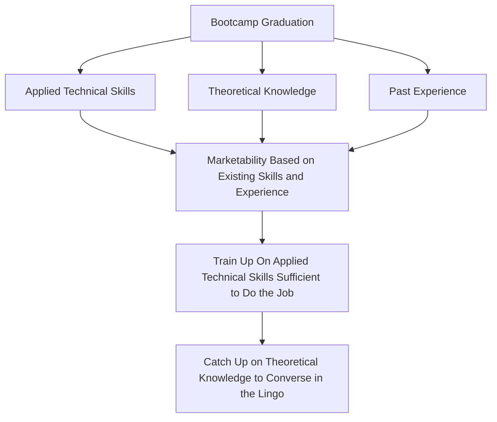

# Ian Yu

## Background

I graduated from BrainStation's Data Science program in 2020.

## Philosophy

There are three pillars for competency after graduation:

- **Applied Technical Skills:** Bootcamp graduates are exposed to a variety
of tools and techniques used today, which is an advantage they have over
a computer science graduate. Typically, it is expected for CS graduates to
learn these skills on the job, so the "time to competency" can be shorter
for bootcamp graduates.
- **Theoretical Knowledge:** That said, bootcamp graduates lack the theoretical
understanding of computer science concepts that CS graduates spent years to hone
on. It is an area that bootcamp graduates need to catch up on, but not spent too
much of their time on initially.
- **Past Experience:** Bootcamp graduates come from a variety of background. These
experiences are valuable, even if they are not directly related to the field.
Straightforward ones like statistical skills and domain knowledge are valuable. Even
if you worked in retail, there are soft transferable skills that you can market.

I suggest bootcamp graduates prioritize strategizing their marketability based on
past experiences and strengths, then focus on acquiring essential applied technical
skills without overdoing it. Finally, dedicate time to catching up on basic
theoretical knowledge, making sure to watch out for diminishing returns in what
you do and optimize every moment spent.

